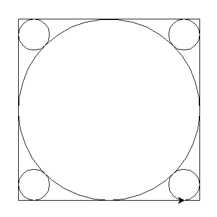
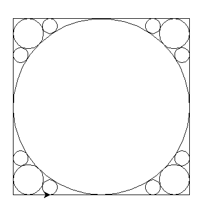
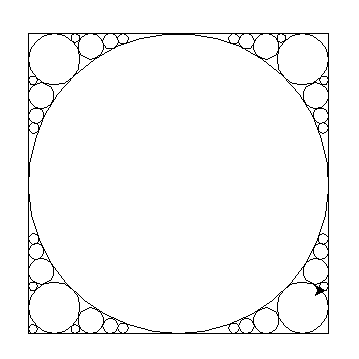
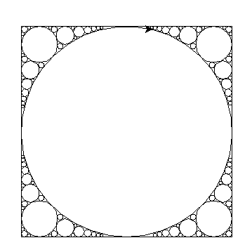

## 1. Introduction
> **In a box bounded by [-1, 1], given m balloons (they cannot overlap) with variable radio r and position mu, find the optimal value of r and mu which maximize sum r^2**
## 2. Setup github respository
``` bash
$ mkdir SoftwareEngineer
$ cd SoftwareEngineer
$ git init
$ git commit -m "the first file to commit"
[master (root-commit) 0c72641] the first file to commit
1 files changed, 1 insertions(+), 0 deletions(-)
$ git remote add origin git@github.com:lizekang/SoftwareEngineer.git
$ git push -u origin master
```
## 3. Algorithm
- This is a np-hard problem. I can't find the best answer. So I choose greedy algorithm which means that I will always choose the biggest circle in the loop.
- 1. Init a queue to store every small area that are generated by edges and circles.
  2. Choose the biggest circle (0.5, 0.5, 0.5) (I use (x, y, r) to represent a circle)
  3. Add four generated areas into the queue.
  4. Pop the first area, and calculate the biggest circle in this area.
  5. Find the right position to insert the circle we generated in last step to make the queue sorted by descending order of R.
  6. Loop step 4~5, until the circles' number is m
  7. Plot the circles by by the order of generating.
## 4. Test cases
- m = 4
- m = 12
- m = 36
- m = 100
## 5. Code
``` python
#! /usr/bin/python2
# -*- coding:utf-8 -*-


import math
import turtle


class Point(object):
    def __init__(self, x, y):
        self.x = x
        self.y = y


class Edge(object):
    def __init__(self, point1, point2):
        self.A = point2.y - point1.y
        self.B = point1.x - point2.x
        self.C = point2.x*point1.y - point1.x*point2.y


class Circle1(object):
    def __init__(self, point, r):
        self.point = point
        self.r = r


def p(num):
    return pow(num, 2)


def point_with_2edges(edge1, edge2):
    A1 = edge1.A
    A2 = edge2.A
    B1 = edge1.B
    B2 = edge2.B
    C1 = edge1.C
    C2 = edge2.C
    x = ((C1 * B2 - B1 * C2)/(A2 * B1 - A1 * B2) if C1 * B2 - B1 * C2 != 0 else 0)
    y = ((A1 * C2 - A2 * C1) / (A2 * B1 - A1 * B2) if A1 * C2 - A2 * C1 != 0 else 0)
    return Point(x, y)


def suround_by_2edges_and_1circle(edge1, edge2, circle):
    point1 = point_with_2edges(edge1, edge2)
    point2 = circle.point
    r = (point2point(point1, circle.point) - circle.r) / (1 + math.sqrt(2))
    point = Point(point1.x + math.sqrt(2)*(point2.x - point1.x)/(circle.r + (1+math.sqrt(2))*r)*r,
                  point1.y + math.sqrt(2)*(point2.y - point1.y)/(circle.r + (1+math.sqrt(2))*r)*r)
    return Circle1(point, r)


def point2point(point1, point2):
    return math.sqrt(pow(point1.x - point2.x, 2) + pow(point1.y - point2.y, 2))


def point2edge(point, edge):
    return abs(edge.A * point.x + edge.B * point.y + edge.C) / math.sqrt(pow(edge.A, 2) + pow(edge.B, 2))


def surround_by_3circles(circle1, circle2, circle3):
    x1 = circle1.point.x
    y1 = circle1.point.y
    x2 = circle2.point.x
    y2 = circle2.point.y
    x3 = circle3.point.x
    y3 = circle3.point.y
    r1 = circle1.r
    r2 = circle2.r
    r3 = circle3.r
    k1 = ((r2 - r3) / (x2 - x3) - (r1 - r2) / (x1 - x2)) / ((y1 - y2) / (x1 - x2) - (y2 - y3) / (x2 - x3))
    b1 = ((p(x1) - p(x2) + p(y1) - p(y2) - p(r1) + p(r2))/(2*(x1-x2)) - (p(x2) - p(x3) + p(y2) - p(y3) - p(r2) + p(r3))/(2*(x2-x3)))/((y1 - y2) / (x1 - x2) - (y2 - y3) / (x2 - x3))
    k2 = (r3-r2)/(x2-x3) - k1*(y2-y3)/(x2 - x3)
    b2 = (p(x2) - p(x3) + p(y2) - p(y3) - p(r2) + p(r3))/(2*(x2-x3)) - b1*(y2-y3)/(x2-x3)

    a = p(k2) + p(k1) - 1
    b = 2*k2*(b2-x1) + 2*k1*(b1-y1) - 2*r1
    c = p(b2-x1) + p(b1-y1) - p(r1)

    r = -c/b
    x = k2*r + b2
    y = k1*r + b1
    return Circle1(Point(x, y), r)


def surround_by_2circles_and_1edge(circle1, circle2, edge2):
    A = edge2.A
    B = edge2.B
    C = edge2.C
    r1 = circle1.r
    r2 = circle2.r
    x1 = circle1.point.x
    y1 = circle1.point.y
    x2 = circle2.point.x
    y2 = circle2.point.y
    r = pow((math.sqrt(r1 * r2) / (math.sqrt(r1) + math.sqrt(r2))), 2)
    theta1 = (pow(r1, 2) - pow(r2, 2) + 2 * r * (r1 - r2) - pow(x1, 2) + pow(x2, 2) - pow(y1, 2) + pow(y2, 2)) / 2
    theta2 = r * math.sqrt(pow(A, 2) + pow(B, 2)) - C
    if C == 0 and (B == -1 or A == -1):
        theta2 = -theta2
    y = (theta2 * (x2 - x1) - theta1 * A) / (B * (x2 - x1) - A * (y2 - y1))
    x = (theta1 - y*(y2-y1))/(x2-x1)
    return Circle1(Point(x, y), r)


class suroundings(object):
    def __init__(self, type, edges, circles):
        self.type = type
        self.edges = edges
        self.circles = circles
        self.circle = self.new_circle()

    def new_circle(self):
        if self.type == 1:
            return suround_by_2edges_and_1circle(self.edges[0], self.edges[1], self.circles[0])
        elif self.type == 2:
            return surround_by_2circles_and_1edge(self.circles[0], self.circles[1], self.edges[0])
        else:
            return surround_by_3circles(self.circles[0], self.circles[1], self.circles[2])

    def new_surroundings(self):
        if self.type == 1:
            return [suroundings(1, [self.edges[0], self.edges[1]], [self.circle]),
                    suroundings(2, [self.edges[0]], [self.circles[0], self.circle]),
                    suroundings(2, [self.edges[1]], [self.circles[0], self.circle])]
        elif self.type == 2:
            return [suroundings(2, [self.edges[0]], [self.circles[0], self.circle]),
                    suroundings(2, [self.edges[0]], [self.circles[1], self.circle]),
                    suroundings(3, [], [self.circles[0], self.circles[1], self.circle])]
        else:
            return [suroundings(3, [], [self.circle, self.circles[1], self.circles[2]]),
                    suroundings(3, [], [self.circles[0], self.circle, self.circles[2]]),
                    suroundings(3, [], [self.circles[0], self.circles[1], self.circle])]


def main(N):
    queue = []
    result = list()
    circle0 = Circle1(Point(0.5, 0.5), 0.5)
    edge1 = Edge(Point(0, 0), Point(1, 0))
    edge2 = Edge(Point(0, 0), Point(0, 1))
    edge3 = Edge(Point(0, 1), Point(1, 1))
    edge4 = Edge(Point(1, 1), Point(1, 0))
    result.append(circle0)
    queue.append(suroundings(1, [edge1, edge2], [circle0]))
    queue.append(suroundings(1, [edge2, edge3], [circle0]))
    queue.append(suroundings(1, [edge3, edge4], [circle0]))
    queue.append(suroundings(1, [edge4, edge1], [circle0]))
    while len(queue) > 0 and N >= 0:
        surrounding = queue.pop(0)
        newCircle = surrounding.circle
        for surround in surrounding.new_surroundings():
            for i in range(0, len(queue)):
                if surround.circle.r >= queue[i].circle.r:
                    queue.insert(i, surround)
                    break
                if i == len(queue) - 1:
                    queue.append(surround)

        result.append(newCircle)
        N -= 1
    return result


def plot(result):
    turtle.penup()
    turtle.goto(0, 300)
    turtle.pendown()
    turtle.forward(300)
    turtle.right(90)
    turtle.forward(300)
    turtle.right(90)
    turtle.forward(300)
    turtle.right(90)
    turtle.forward(300)
    turtle.right(90)
    turtle.penup()
    for item in result:
        turtle.penup()
        turtle.goto(item.point.x*300, (item.point.y-item.r)*300)
        turtle.pendown()
        turtle.circle(item.r*300)
    turtle.exitonclick()

result = main(100)
plot(result)

```

## 6. Test results
- m = 4 
 
 - m = 12
 
- m = 36
 
- m =100
 


## 7. Store my code
``` bash
$ git add .
$ git commit -m "fix a bug"
$ git push origin master
```
