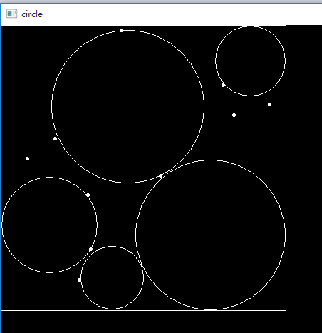
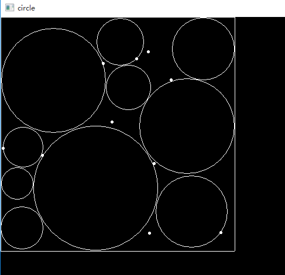
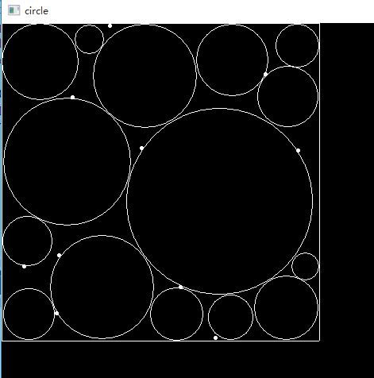
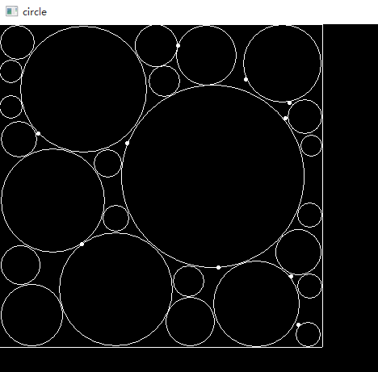

## 1.Introduction
> **In a box bounded by [-1, 1], given m balloons (they cannot overlap) with variable radio r and position mu. And some tiny blocks are in the box at given position {d} ;balloons cannot overlap with these blocks. find the optimal value of r and mu which maximizes sum r^2**

## 2.Algorithm
Same as project 1, it’s also a np-hard problem, and it’s more complicated. Although I have found lots of paper, I can’t give a valid method to solve the problem.

A simple algorithm to solve this problem is called Grid Algorithm.

1. We divide the while area into lots of grids. The more grids divided into, the more valid the result is. We assume the blocks and the center of circles can be only places at the grid points.
2.  Based in our assumption, we use greedy algorithm to solve our problem. First we calculate the biggest circle can be placed in current pattern. Then we place the circle into the area and update our pattern. Repeat the steps above until all the circles have been places into area.
3.  The information of all the circles is what we need.

## 3.Test
- Test classes
	- Point 
	- Egde
	- Circle

- Test queue. 
- Test grid algorithm.
- Test greedy algorithm.
- Test plot part. 

## 4.Experinment
- m = 5


- m = 10


- m = 15
 

- m = 25


## 5.Conclusion
The problem itself is a NP-Hard problem, which is useful in lots of space. Although our greedy algorithm and grid algorithm can’t calculate very exactly, it’s enough to solve the practical problem. For exacter result, we can divide more grids as it’s referred in Part2.


## 6.Appendix
```
commit b2e27f3497d669824ea02b316a424ce025d37398
Author: lizekang <zekangli@hustunique.com>
Date:   Fri Jun 9 18:16:22 2017 +0800

    finish project2 and add readme.md

commit bbdc74778462bdded77fd28823a52edeaa914f54
Author: lizekang <zekangli@hustunique.com>
Date:   Tue Jun 6 23:52:41 2017 +0800

    add LICENSE

commit 57727fbc4f3629882d1855338976e8fa6f97af9f
Author: ZekangLi <zekangli@hustunique.com>
Date:   Tue Jun 6 10:51:01 2017 -0500

    Create README.md

commit f090cee5a3e980ddbf0c2a14a67a78ea3293a768
Merge: f54493e f170bde
Author: lizekang <zekangli@hustunique.com>
Date:   Tue Jun 6 23:49:46 2017 +0800

    start project2

commit f54493ed1747080137d701eedeedfc19a92c9833
Author: lizekang <zekangli@hustunique.com>
Date:   Tue Jun 6 23:48:56 2017 +0800

    start project2

```
